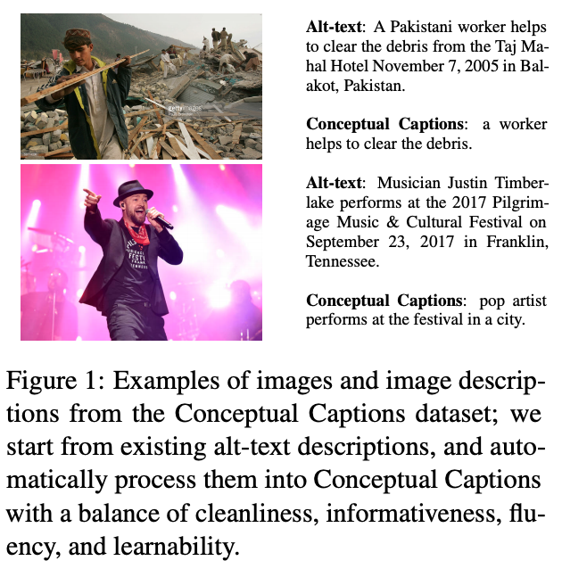
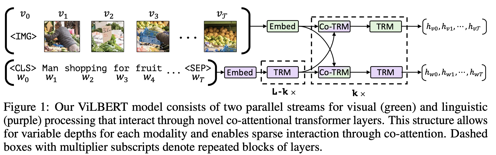
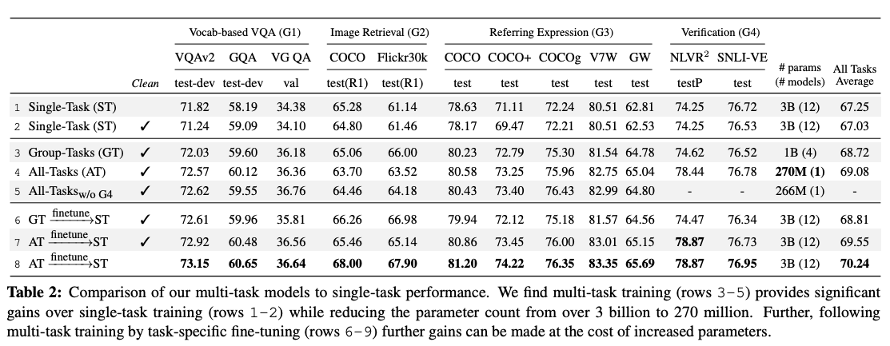

[Conceptual Captions: A Cleaned, Hypernymed, Image Alt-text Dataset For Automatic Image Captioning (ACL'2018)](https://www.aclweb.org/anthology/P18-1238.pdf)
Piyush Sharma, Nan Ding, Sebastian Goodman, Radu Soricut
(Google AI, Venice)

    

[ViLBERT: Pretraining Task-Agnostic Visiolinguistic Representations for Vision-and-Language Tasks (NIPS'2019)](https://arxiv.org/abs/1908.02265)
**Jiasen Lu**1, Dhruv Batra1,2, **Devi Parikh**1,2, Stefan Lee1,3
(1Georgia Institute of Technology, 2Facebook AI Research, 3Oregon State University)

    

[12-in-1: Multi-Task Vision and Language Representation Learning (CVPR'2020)](https://arxiv.org/abs/1912.02315)
**Jiasen Lu**3* Vedanuj Goswami1* Marcus Rohrbach1 **Devi Parikh**1,3 Stefan Lee2
(1Facebook AI Research 2Oregon State University 3Georgia Institute of Technology)

    

