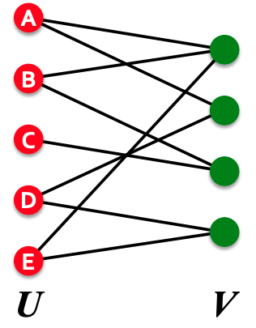
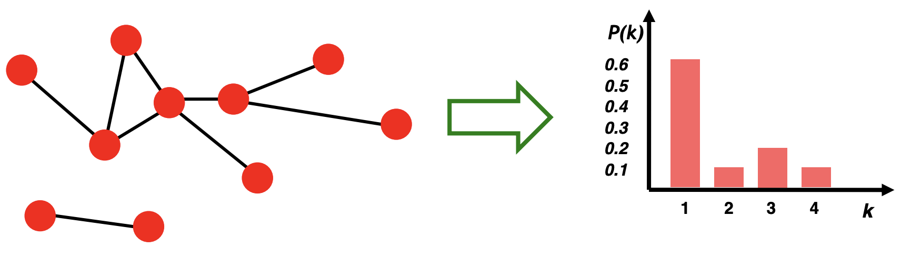
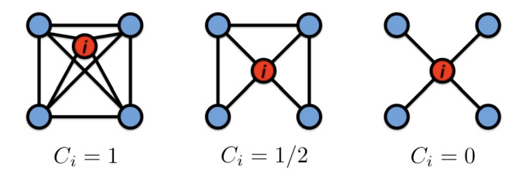
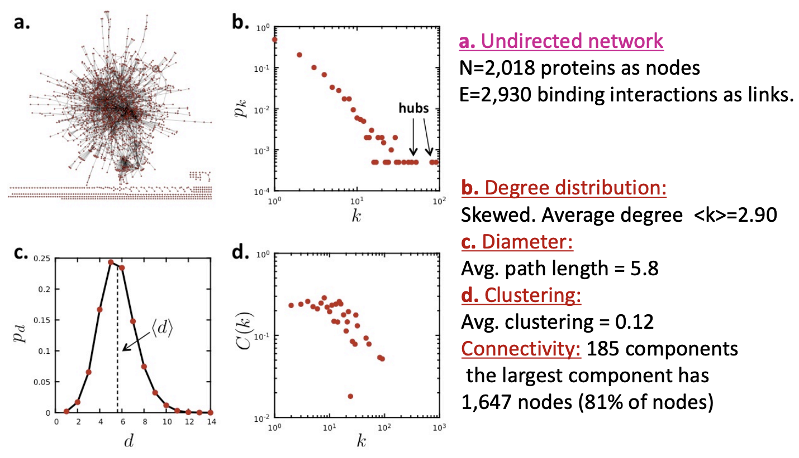
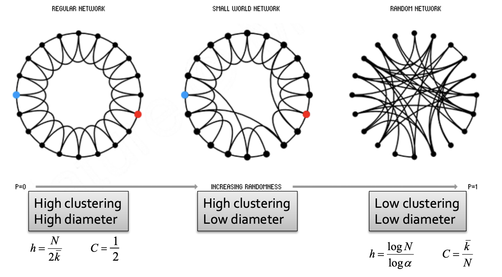

#### [Introduction Structure of Graphs](http://web.stanford.edu/class/cs224w/slides/01-intro.pdf)

##### Bipartite graph 
is a graph whose nodes can be divided into two disjoint sets U and V such that every link connects a node in U to one in V; that is, U and V are independent sets.

<link href="https://maxcdn.bootstrapcdn.com/bootstrap/4.0.0-beta.2/css/bootstrap.min.css" rel="stylesheet"/>

  

    

      
    

    

    Exampls:
        <li> Authors-to-Papers (they authored) </li>
        <li>  Actors-to-Movies (they appeared in) </li>
        <li>  Users-to-Movies (they rated) </li>
        <li>  Recipes-to-Ingredients (they contain) </li>
    

  

#### [Properties of Networks and Random Graph Models](http://web.stanford.edu/class/cs224w/slides/02-gnp-smallworld.pdf)
##### Key Network Properties
* **Degree distribution**: $P(k)$
  * $N_k$ = # nodes with degree $k$, and $P(k) = N_k / N$
    
    
* **Path length**: $h$ 
  * $\bar{h} = \frac{1}{2E_{max}} \sum_{i,j \neq i} h_{ij}$, where 
    * $h_{ij}$ is the distance from node $i$ to node $j$ 
    * $E_{max}$ is the max number of edges $n(n-1)/2$.
* **Clustering coefficient**: $C$ 
  * $C_i \in [0,1], C_i = \frac{2e_i}{k_i(k_i-1)}$, where $e_i$ is # of edges between the neighbors of node $i$.
  * Note $k_i(k_i-1)$ is max number of edges between the $k_i$ neighbors.
  
  * Average clustering coefficient: $C = \frac{1}{N} \sum_{i}^N C_i$
* **Connected components**: $s$
  * Size of the largest connected component (Largest set where any two vertices can be joined by a path.)

##### Erdös-Renyi Random Graphs [Erdös-Renyi, ‘60]
* $G_{np}$: undirected graph on $n$ nodes where each edge $(u,v)$ appears i.i.d. with probability $p$.s
    * Degree distribution: $P(k)=\left(\begin{array}{c}n-1 \\ k\end{array}\right) p^{k}(1-p)^{n-1-k}$
    * Path length: $O(\log n)$
    * Clustering coefficient: $C=p=\bar{k} / n$
    * Connected components: GCC exists when $\bar{k}>1$.

##### Small-World Model [Watts-Strogatz ‘98]
* Start with a low-dimensional regular lattice
* Rewire: Introduce randomness (“shortcuts”)
