### [Stanford CS224n: Natural Language Processing with Deep Learning](http://web.stanford.edu/class/cs224n/) 
Reference Textbooks:
* Dan Jurafsky and James H. Martin. [Speech and Language Processing (3rd ed. draft)](https://web.stanford.edu/~jurafsky/slp3/)
* Jacob Eisenstein. [Natural Language Processing](https://github.com/jacobeisenstein/gt-nlp-class/blob/master/notes/eisenstein-nlp-notes.pdf)
* Delip Rao and Brian McMahan. Natural Language Processing with PyTorch

| Topic | Course Material| Suggested Readings| Remark|
| ---------------- | ---- | ------------ | ---- |
| Introduction and **Word Vectors** | [[slides]](http://web.stanford.edu/class/cs224n/slides/cs224n-2020-lecture01-wordvecs1.pdf) [[notes]](http://web.stanford.edu/class/cs224n/readings/cs224n-2019-notes01-wordvecs1.pdf)   Gensim word vectors example: [[code]](http://web.stanford.edu/class/cs224n/materials/Gensim.zip) [[preview]](http://web.stanford.edu/class/cs224n/materials/Gensim%20word%20vector%20visualization.html) | 

Click to expand
1. [Word2Vec Tutorial - The Skip-Gram Model](http://mccormickml.com/2016/04/19/word2vec-tutorial-the-skip-gram-model/)   2. [Efficient Estimation of Word Representations in Vector Space](http://arxiv.org/pdf/1301.3781.pdf) (original word2vec paper, 2013)   3. [Distributed Representations of Words and Phrases and their Compositionality](http://papers.nips.cc/paper/5021-distributed-representations-of-words-and-phrases-and-their-compositionality.pdf) (negative sampling paper, 2014) | 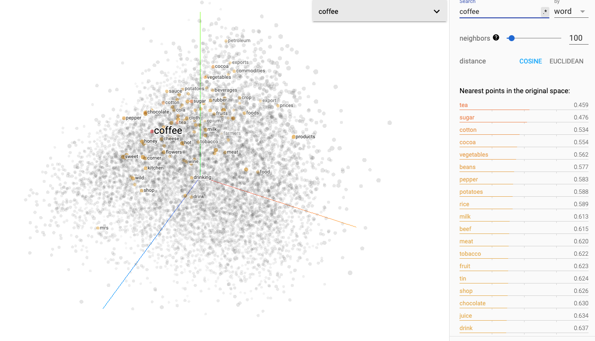
| **Word Vectors** and **Word Senses** | [[slides]](http://web.stanford.edu/class/cs224n/slides/cs224n-2020-lecture02-wordvecs2.pdf) [[notes]](http://web.stanford.edu/class/cs224n/readings/cs224n-2019-notes02-wordvecs2.pdf) | 

Click to expand
1. [GloVe: Global Vectors for Word Representation](http://nlp.stanford.edu/pubs/glove.pdf) (original GloVe paper)   2. [Improving Distributional Similarity with Lessons Learned from Word Embeddings](http://www.aclweb.org/anthology/Q15-1016)   3. [Evaluation methods for unsupervised word embeddings](http://www.aclweb.org/anthology/D15-1036)   Additional Readings:   1. [A Latent Variable Model Approach to PMI-based Word Embeddings](http://aclweb.org/anthology/Q16-1028)   2. [Linear Algebraic Structure of Word Senses, with Applications to Polysemy](https://transacl.org/ojs/index.php/tacl/article/viewFile/1346/320)   3. [On the Dimensionality of Word Embedding](https://papers.nips.cc/paper/7368-on-the-dimensionality-of-word-embedding.pdf)   4. [Natural Language Processing (Almost) from Scratch](http://www.jmlr.org/papers/volume12/collobert11a/collobert11a.pdf) | 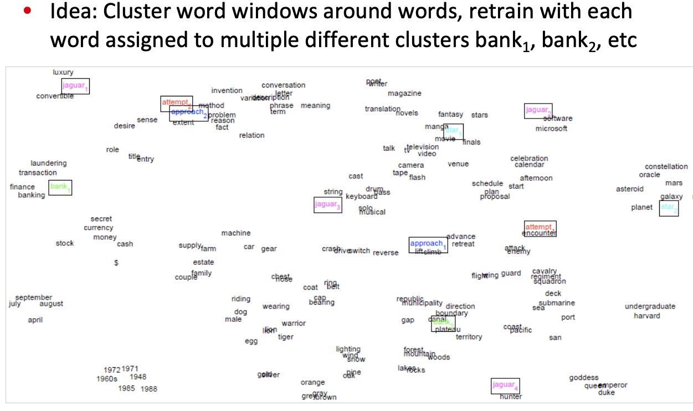
| Linguistic Structure: **Dependency Parsing** |[[slides]](http://web.stanford.edu/class/cs224n/slides/cs224n-2020-lecture05-dep-parsing.pdf) [[notes]](http://web.stanford.edu/class/cs224n/readings/cs224n-2019-notes04-dependencyparsing.pdf)| 

Click to expand
1. [Incrementality in Deterministic Dependency Parsing](https://www.aclweb.org/anthology/W/W04/W04-0308.pdf)   2. [A Fast and Accurate Dependency Parser using Neural Networks](https://www.emnlp2014.org/papers/pdf/EMNLP2014082.pdf)   3. [Dependency Parsing](http://www.morganclaypool.com/doi/abs/10.2200/S00169ED1V01Y200901HLT002)   4. [Globally Normalized Transition-Based Neural Networks](https://arxiv.org/pdf/1603.06042.pdf)   5. [Universal Stanford Dependencies: A cross-linguistic typology](http://nlp.stanford.edu/~manning/papers/USD_LREC14_UD_revision.pdf)   6. [Universal Dependencies website](http://universaldependencies.org/) | 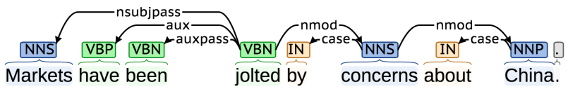
| **Recurrent Neural Networks** and **Language Models** | [[slides]](http://web.stanford.edu/class/cs224n/slides/cs224n-2020-lecture06-rnnlm.pdf) [[slides2]](http://web.stanford.edu/class/cs224n/slides/cs224n-2020-lecture07-fancy-rnn.pdf) [[notes]](http://web.stanford.edu/class/cs224n/readings/cs224n-2019-notes05-LM_RNN.pdf) | 

Click to expand
1. [N-gram Language Models](https://web.stanford.edu/~jurafsky/slp3/3.pdf) (textbook chapter)   2. [The Unreasonable Effectiveness of Recurrent Neural Networks](http://karpathy.github.io/2015/05/21/rnn-effectiveness/) (blog post overview)   3. [Sequence Modeling: Recurrent and Recursive Neural Nets](http://www.deeplearningbook.org/contents/rnn.html) (Sections 10.1 and 10.2)   4. [On Chomsky and the Two Cultures of Statistical Learning](http://norvig.com/chomsky.html)   5. [Sequence Modeling: Recurrent and Recursive Neural Nets](http://www.deeplearningbook.org/contents/rnn.html) (Sections 10.3, 10.5, 10.7-10.12) | 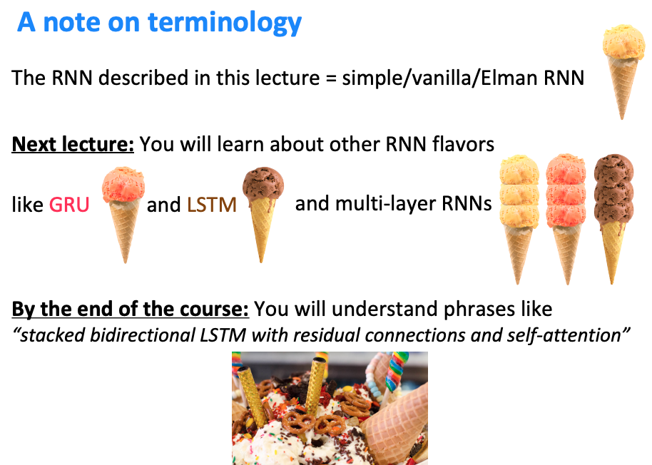
| **Machine Translation**, **Seq2Seq** and **Attention** | [[slides]](http://web.stanford.edu/class/cs224n/slides/cs224n-2020-lecture08-nmt.pdf) [[notes]](http://web.stanford.edu/class/cs224n/readings/cs224n-2019-notes06-NMT_seq2seq_attention.pdf) | 

Click to expand
1. [Statistical Machine Translation slides, CS224n 2015](https://web.stanford.edu/class/archive/cs/cs224n/cs224n.1162/syllabus.shtml) (lectures 2/3/4)   2. [Statistical Machine Translation](https://www.cambridge.org/core/books/statistical-machine-translation/94EADF9F680558E13BE759997553CDE5) (book by Philipp Koehn)   3. [BLEU (Bilingual Evaluation Understudy)](https://www.aclweb.org/anthology/P02-1040.pdf) (original paper)   4. [Sequence to Sequence Learning with Neural Networks](https://arxiv.org/pdf/1409.3215.pdf) (original seq2seq NMT paper)   5. [Sequence Transduction with Recurrent Neural Networks](https://arxiv.org/pdf/1211.3711.pdf) (early seq2seq speech recognition paper)   6.[Neural Machine Translation by Jointly Learning to Align and Translate](https://arxiv.org/pdf/1409.0473.pdf) (original seq2seq+attention paper)  7. [Attention and Augmented Recurrent Neural Networks](https://distill.pub/2016/augmented-rnns/) (blog post overview)   8. [Massive Exploration of Neural Machine Translation Architectures](https://arxiv.org/pdf/1703.03906.pdf) (practical advice for hyperparameter choices) | 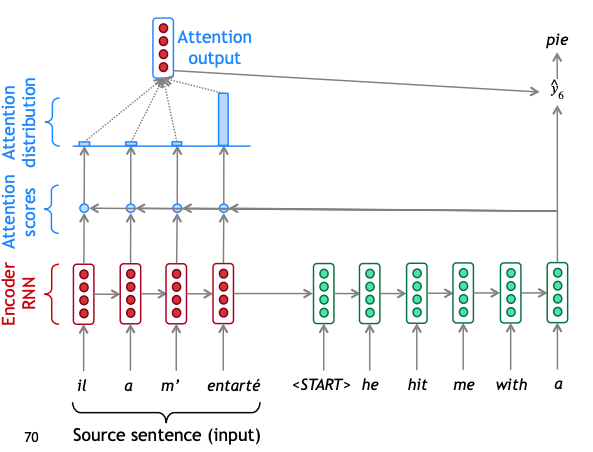   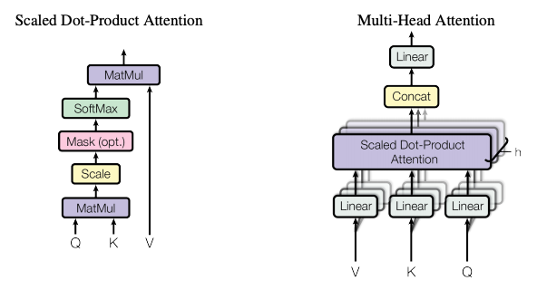
| **Question Answering** and an introduction to **Transformer** architectures |[[slides]](http://web.stanford.edu/class/cs224n/slides/cs224n-2020-lecture10-QA.pdf) [[notes]](http://web.stanford.edu/class/cs224n/readings/cs224n-2019-notes07-QA.pdf) | 

Click to expand
1. [Attention Is All You Need](https://arxiv.org/abs/1706.03762.pdf)   2. [The Illustrated Transformer](https://jalammar.github.io/illustrated-transformer/)   3. [Transformer](https://ai.googleblog.com/2017/08/transformer-novel-neural-network.html) (Google AI blog post)   4. [Layer Normalization](https://arxiv.org/pdf/1607.06450.pdf)   5. [Image Transformer](https://arxiv.org/pdf/1802.05751.pdf)   5. [Music Transformer: Generating music with long-term structure](https://arxiv.org/pdf/1809.04281.pdf) | 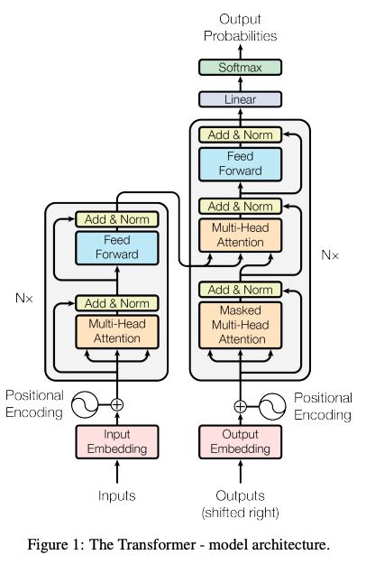   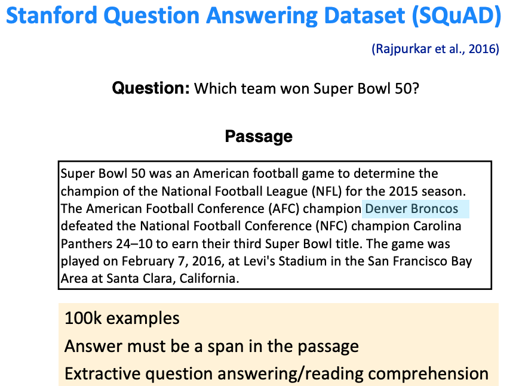
| Information from parts of words (Subword Models) | [[slides]](http://web.stanford.edu/class/cs224n/slides/cs224n-2020-lecture12-subwords.pdf) | 

Click to expand
1. [Achieving Open Vocabulary Neural Machine Translation with Hybrid Word-Character Models](https://arxiv.org/abs/1604.00788.pdf)   2. [Revisiting Character-Based Neural Machine Translation with Capacity and Compression](https://arxiv.org/pdf/1808.09943.pdf) 
| Guest Lecture: Contextual Word Representations-BERT| [[slides]](http://web.stanford.edu/class/cs224n/slides/Jacob_Devlin_BERT.pdf) | 

Click to expand
1. [BERT: Pre-training of Deep Bidirectional Transformers for Language Understanding](https://arxiv.org/pdf/1810.04805.pdf) | 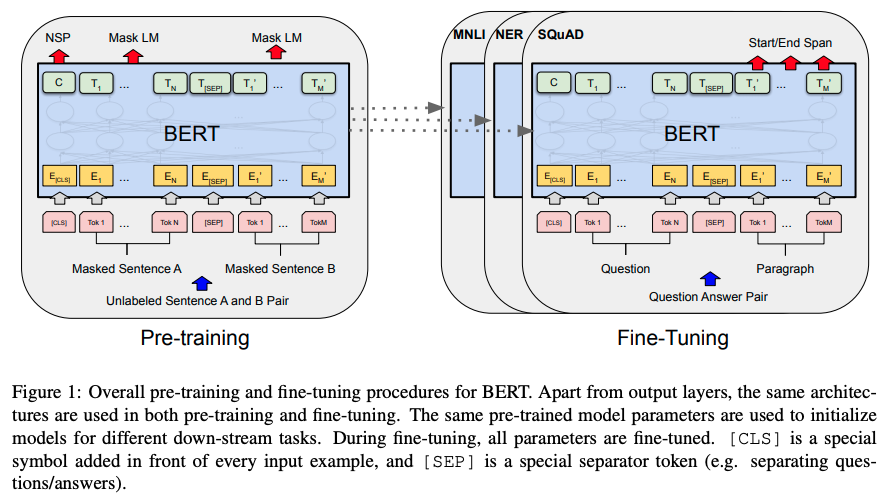
| Modeling contexts of use: **Contextual Representations** and **Pretraining**. **ELMo** and **BERT** | [[slides]](http://web.stanford.edu/class/cs224n/slides/cs224n-2020-lecture14-contextual-representations.pdf) | 

Click to expand
1. [Contextual Word Representations: A Contextual Introduction](https://arxiv.org/abs/1902.06006.pdf)   2. [The Illustrated BERT, ELMo, and co.](http://jalammar.github.io/illustrated-bert/) | 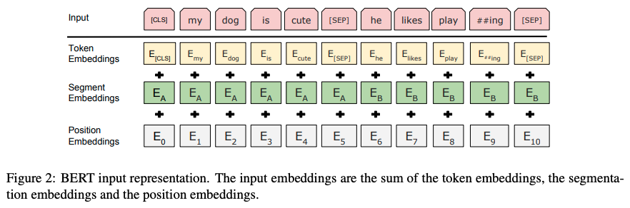   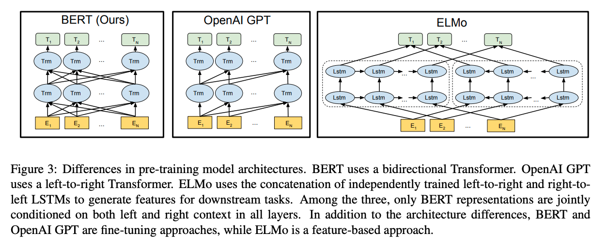
| **Natural Language Generation** | [[slides]](http://web.stanford.edu/class/cs224n/slides/cs224n-2020-lecture15-nlg.pdf) | 

Click to expand
1. [The Curious Case of Neural Text Degeneration](https://arxiv.org/abs/1904.09751.pdf)   2. [Get To The Point: Summarization with Pointer-Generator Networks](https://arxiv.org/abs/1704.04368.pdf)   3. [Hierarchical Neural Story Generation](https://arxiv.org/abs/1805.04833.pdf)   4. [How NOT To Evaluate Your Dialogue System](https://arxiv.org/abs/1603.08023.pdf) | e.g., Machine Translation / (Abstractive) Summarization / Dialogue (chit-chat and task-based) / Creative writing: storytelling, poetry-generation / Freeform Question Answering (i.e. answer is generated, not extracted from text or knowledge base) / Image captioning, ...
| **Reference** in Language and Coreference Resolution | [[slides]](http://web.stanford.edu/class/cs224n/slides/cs224n-2019-lecture16-coref.pdf) | | 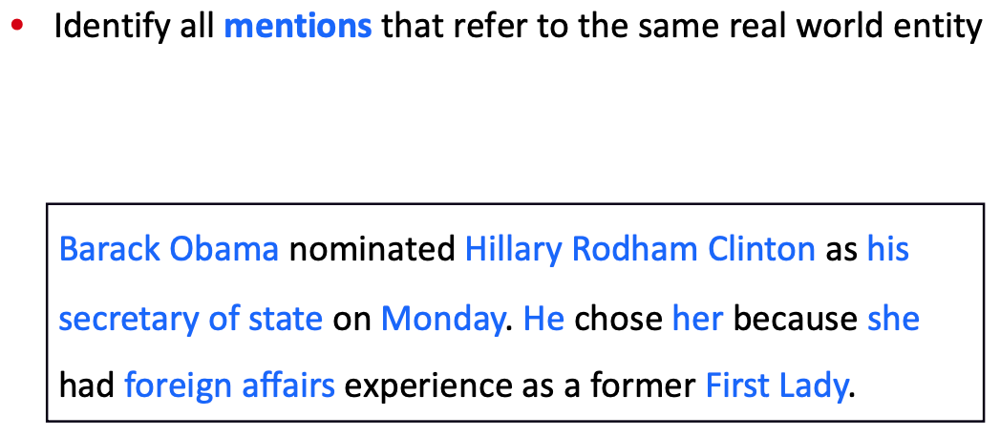
| **Constituency Parsing** and Tree Recursive Neural Networks | [[slides]](http://web.stanford.edu/class/cs224n/slides/cs224n-2020-lecture18-TreeRNNs.pdf) [[notes]](http://web.stanford.edu/class/cs224n/readings/cs224n-2019-notes09-RecursiveNN_constituencyparsing.pdf) | 

Click to expand
1. [Parsing with Compositional Vector Grammars](http://www.aclweb.org/anthology/P13-1045)   2. [Constituency Parsing with a Self-Attentive Encoder](https://arxiv.org/pdf/1805.01052.pdf) | *Dependency parsing* is the process of defining the grammatical structure of a sentence by listing each word as a node and displaying links to its dependents. A *constituency parsed* tree displays the syntactic structure of a sentence using context-free grammar.   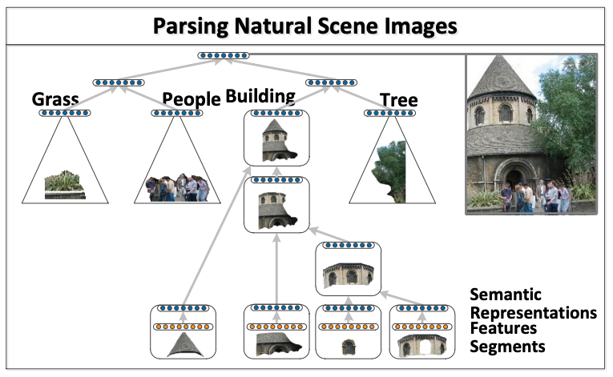
| Guest Lecture: Recent Advances in **Low Resource Machine Translation** | [[slides]](http://web.stanford.edu/class/cs224n/slides/MarcAurelio_Ranzato_Low_Resource_MT.pdf) | | 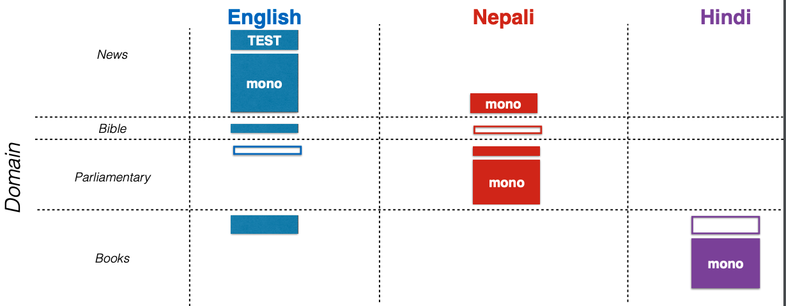
| Analysis and Interpretability of Neural NLP | [[slides]](http://web.stanford.edu/class/cs224n/slides/cs224n-2020-lecture20-interpretability.pdf) | |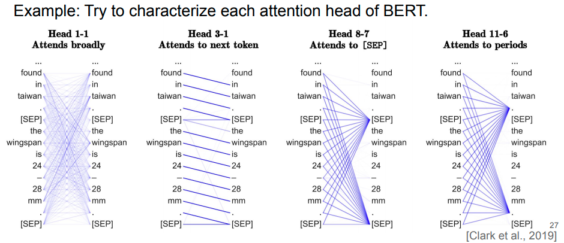

#### Paper List
| Type |  Paper | Venue | Remark
| ---------------- | ---- | ------------ |  --- |
| Survey | [Pre-trained Models for Natural Language Processing: A Survey](https://arxiv.org/pdf/2003.08271v2.pdf) | arxiv 2020 | 

Click to expand
 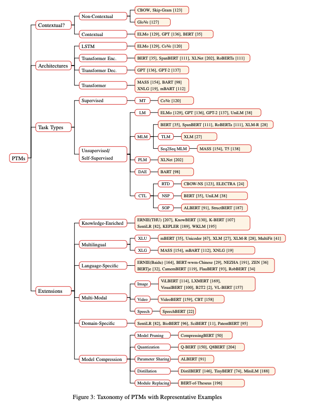
| Survey | [Trends in Integration of Vision and Language Research: A Survey of Tasks, Datasets, and Methods](https://arxiv.org/abs/1907.09358) | arxiv 2019 | 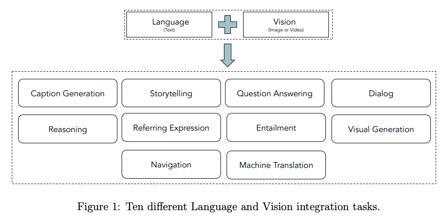
| Survey | [Deep Multimodal Representation Learning: A Survey](https://ieeexplore.ieee.org/abstract/document/8715409) | arXiv 2019 | 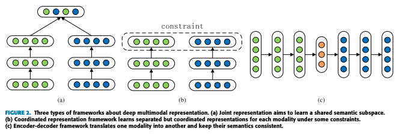
| Survey | [Multimodal Machine Learning: A Survey and Taxonomy](https://arxiv.org/abs/1705.09406) | TPAMI 2018 | 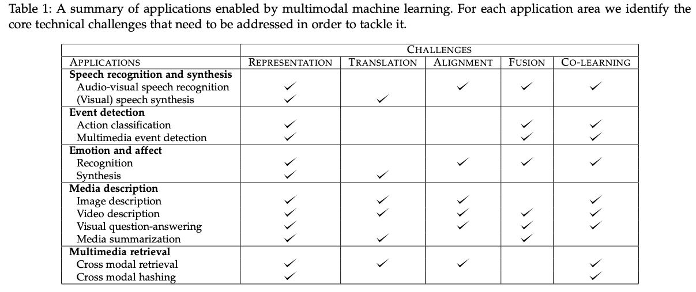