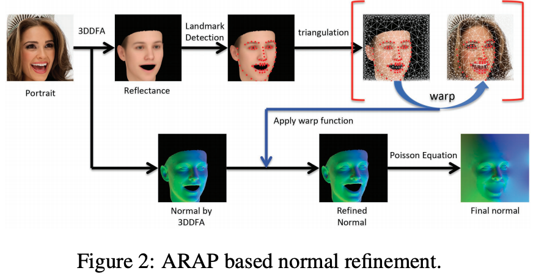
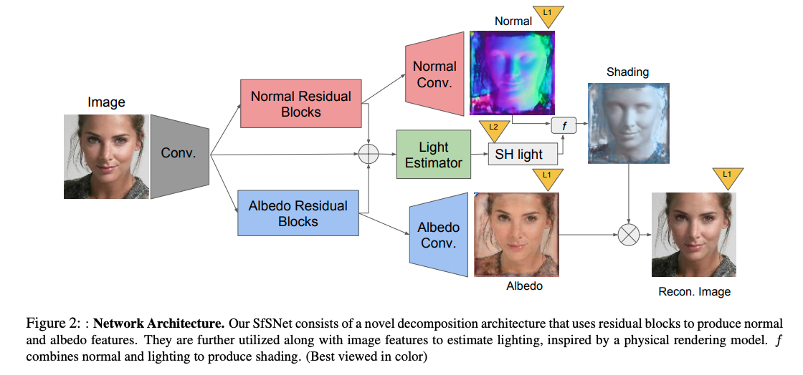
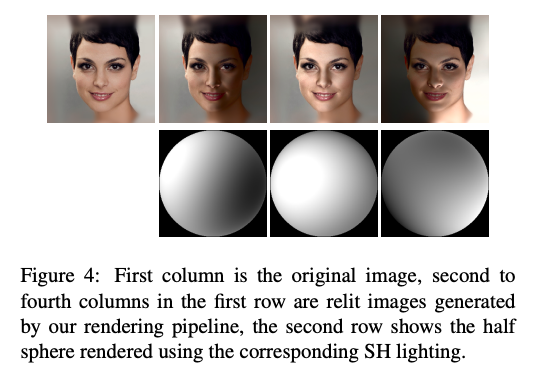
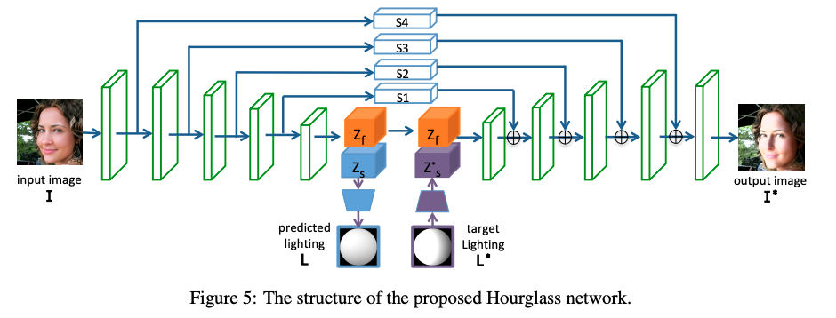
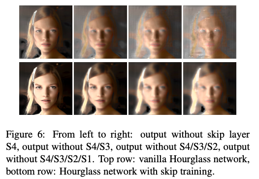
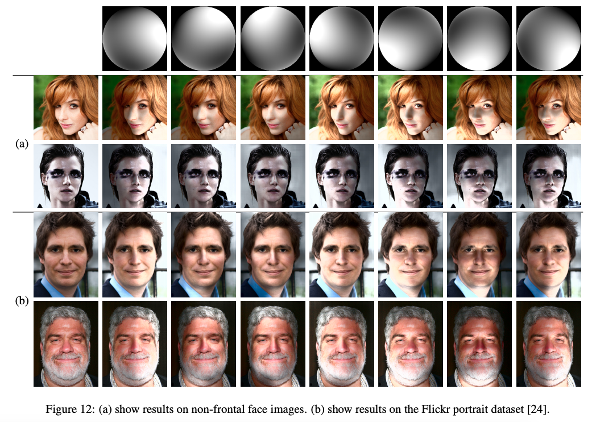

### [Deep Single Image Portrait Relighting (CVPR’19)](https://zhhoper.github.io/paper/zhou_ICCV2019_DPR.pdf)
Hao Zhou, Sunil Hadap, Kalyan Sunkavalli, and David W. Jacobs
(University of Maryland, Amazon, Adobe Research) 
🍃[[Project Page]](https://zhhoper.github.io/dpr.html)

#### Results
<video width="320" height="240" controls>
    <source src="https://zhhoper.github.io/pbr/celebA.mp4">
</video>
<video width="320" height="240" controls>
    <source src="https://zhhoper.github.io/pbr/Occlusion.mp4">
</video>
<video width="320" height="240" controls>
    <source src="https://zhhoper.github.io/pbr/nonFrontal.mp4">
</video>

#### Motivation
Conventional physically-based methods for relighting
portrait images need to solve an inverse rendering problem, **estimating face geometry, reflectance and lighting**, yet the inaccurate estimation of face components can cause strong artifacts in relighting.
=> Thus consider learning based methods
=> Needs large training data

[1] We first apply a physically-based portrait relighting method to generate a large scale, high quality, "in the wild" portrait relighting dataset (DPR). DPR is build on the high resolution
CelebA dataset (CelebA-HQ), which contains 30,000 face images from the CelebA dataset with 1024 × 1024 resolution.
For each of these images, we randomly select 5 lighting conditions from a lighting prior dataset to generate relit face images result in 138,135 relit images.
##### Ratio Image-based (RI-based) Face Relighting
To render a face image $\mathbf{I}$, we need the reflectance $\mathbf{R}$, normal $\mathbf{N}$ and lighting $\mathbf{L}$. A face image $\mathbf{I}$ can thus be represented as 
$$\mathbf{I}=\mathbf{R} \odot f(\mathbf{N}, \mathbf{L}),$$
where $f$ is the Lambertian shading function.
To relight a face image, we apply the ratio image trick.
The same face under two different lighting conditions can be represented as
$\mathbf{I}=\mathbf{R} \odot f(\mathbf{N}, \mathbf{L})$ and $\mathbf{I}^{*}=\mathbf{R} \odot f\left(\mathbf{N}, \mathbf{L}^{*}\right)$, and 
$$
\begin{aligned}
\mathbf{I}^{*} &=\mathbf{R} \odot f\left(\mathbf{N}, \mathbf{L}^{*}\right) \\
&=\frac{\mathbf{R} \odot f\left(\mathbf{N}, \mathbf{L}^{*}\right)}{\mathbf{R} \odot f(\mathbf{N}, \mathbf{L})}(\mathbf{R} \odot f(\mathbf{N}, \mathbf{L})) \\
&=\frac{f\left(\mathbf{N}, \mathbf{L}^{*}\right)}{f(\mathbf{N}, \mathbf{L})} \mathbf{I}
\end{aligned}
$$
Thus a portrait image $\mathbf{I}^{*}$ under lighting $\mathbf{L}^{*}$ can be generated given portrait image $\mathbf{I}$ and its normal $\mathbf{N}$ and lighting $\mathbf{L}$. 
###### Normal Estimation
We use **3DDFA** to estimates normals from portrait images  since it outputs the shape parameters of a 3DMM, which can be used to generate portrait normal images at arbitrary resolution. Then we propose aligning the estimated normals with the portrait image using an ARAP-based normal refinement algorithm.
<p align="center">
    
</p>
###### Relighting Images
We then use **SfSNet** to estimate SH lighting $\mathbf{L}^{*}$
<p align="center">
    
     
</p>
[2] A deep Convolutional Neural Network (CNN) is then trained using this dataset to generate a relighted portrait image by using a source image and a target lighting as input. 
##### Main Architecture
<p align="center">
    
</p>
##### Loss Design
We apply L1 loss for generated portrait image $\mathbf{I}_{t}^{*}$ and an L2 loss for the predicted lighting $\mathbf{L}_{s}^{*}$. An L1 loss is further applied to the gradient of $\mathbf{I}_{t}^{*}$ to preserve edges and avoid blurring:
$$
\mathcal{L}_{I}=\frac{1}{N_{I}}\left(\left\|\mathbf{I}_{t}-\mathbf{I}_{t}^{*}\right\|_{1}+\left\|\nabla \mathbf{I}_{t}-\nabla \mathbf{I}_{t}^{*}\right\|_{1}\right)+\left(\mathbf{L}_{s}-\mathbf{L}_{s}^{*}\right)^{2}
$$
Use a GAN loss to improve the quality of the generated images
$$
\mathcal{L}_{G A N}=\mathbb{E}_{\mathbf{I}}(1-D(\mathbf{I}))^{2}+\mathbb{E}_{\mathbf{I}_{\mathbf{s}}} D\left(G\left(\mathbf{I}_{s}, \mathbf{L}_{t}\right)\right)^{2}
$$
A feature matching loss is further proposed to ensure the same person under different lighting conditions should have the same face features.
$$
\mathcal{L}_{F}=\frac{1}{N_{F}}\left(\mathbf{Z}_{\mathrm{f} 1}-\mathbf{Z}_{\mathrm{f} 2}\right)^{2}
$$

```math
\mathcal{L}_{F}=\frac{1}{N_{F}}\left(\mathbf{Z}_{\mathrm{f} 1}-\mathbf{Z}_{\mathrm{f} 2}\right)^{2}
```

##### Skip Training
Notice that most of the facial information is passed through skip layers, while $\mathbf{Z}_{\mathbf{f}}$ contains little facial information. We thus propose a skip training strategy in which we train our network without skip connections first, then add skip layers one by one during subsequent training. With the skip training strategy, more facial information is kept in the feature layer.
<p align="center">
    
</p>
[3] Our trained network can relight portrait images with resolutions as high as 1024 X 1024.
<p align="center">
    
</p>

#### References
[6] Volker Blanz and Thomas Vetter. **A morphable model for the synthesis of 3d faces.** In SIGGRAPH, 1999.

[22] Soumyadip Sengupta, Angjoo Kanazawa, Carlos D. Castillo, and David W. Jacobs. **Sfsnet: Learning shape, refectance and illuminance of faces in the wild.** In CVPR, 2018.