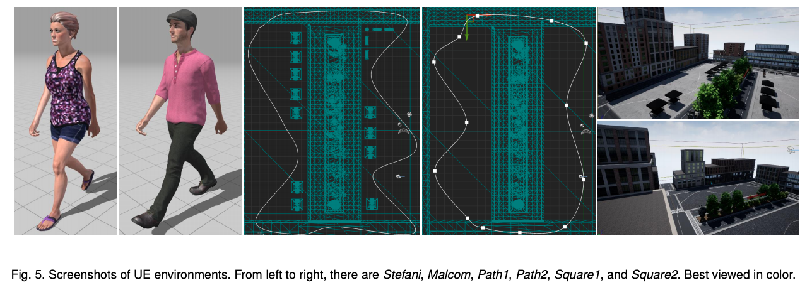

List of popular game engines: `Unreal Engine`, `Unity`, `GTA V`, `mixamo`, `blender`.

[TransMoMo: Invariance-Driven Unsupervised Video Motion Retargetings](https://arxiv.org/pdf/2003.14401v2.pdf)(CVPR'20)
* Platform: [Adobe mixamo](https://www.mixamo.com/#/)

    

[SAIL-VOS: Semantic Amodal Instance Level Video Object Segmentation - A Synthetic Dataset and Baselines](http://sailvos.web.illinois.edu/_site/index.html#publication) (CVPR'19)
🔗[Free supervision from video games](https://zpascal.net/cvpr2018/Krahenbuhl_Free_Supervision_From_CVPR_2018_paper.pdf)(CVPR'18)

    

* Game: `GTA-V`
* Data Collection: We use the [`Script Hook V library`](http://www.dev-c.com/gtav/scripthookv/) for altering the weather, the time of day, the clothing and pausing the game as well as toggling the visibility of objects. Along with the screenshots (RGB images), we hook into DirectX functions to access the GPU resources and save the corresponding stencil and depth buffers as shown in Fig. 3. The DirectX hooks are based on the [`GameHook`](https://zpascal.net/cvpr2018/Krahenbuhl_Free_Supervision_From_CVPR_2018_paper.pdf) library. The stencil buffer contains the semantic label of each pixel at the class level, instead of at the instance level, e.g., all pixels belonging to a person will be assigned the same value no matter whether they belong to sthe same person or not.

    
    

[Dissecting Person Re-identification from the Viewpoint of Viewpoint](https://arxiv.org/pdf/1812.02162.pdf) (CVPR'19) 
* Game: `Unity`
* Data Collection: The PersonX engine is built on [`Unity`](https://unity.com/). We create a 3D controllable world containing 1,266 person models including 547 females and 719 males. To ensure diversity, we hand-crafted the human models with different skin colors, ages, body forms (height and weight), hair styles, etc. The clothes of these identities include jeans, pants, shorts,slacks, skirts, T-shirts, dress shirts, maxiskirt, etc., and some of these identities have a backpack, shoulder bag, glasses or hat. The materials of the clothes (color and texture) are mapped from images of real-world clothes. The motion of these characters can be walking, running, idling (standing), having a dialogue etc.

    

[End-to-end Active Object Tracking and Its Real-world Deployment via Reinforcement Learning](https://arxiv.org/pdf/1808.03405.pdf)(TPAMI'19)
* Game: `Unreal Engine` ([UnrealCV](https://arxiv.org/pdf/1609.01326.pdf))

    

[Playing for Data: Ground Truth from Computer Games](https://arxiv.org/pdf/1608.02192.pdf)(ECCV'16)